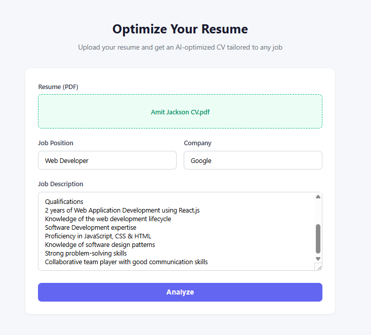
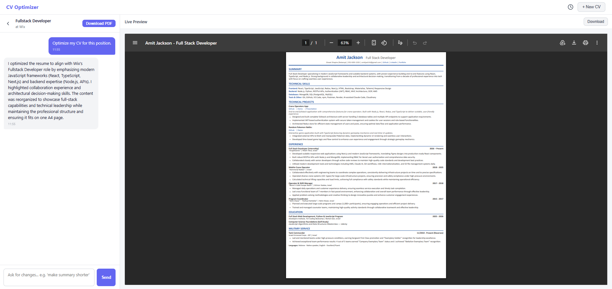
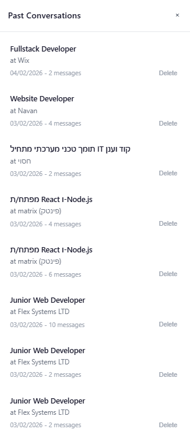

# 📄 CV Optimizer Agent

An AI-powered resume optimization tool that tailors your CV to any job description — powered by **Claude AI**. Upload your PDF resume, paste the job details, and get a professionally optimized, single-page A4 PDF in seconds.

> 🔒 **Privacy first:** The optimizer never invents skills or experiences. It only rewrites, reorders, and emphasizes what's already in your resume.


---

## ✨ Features

- 📤 **PDF Upload** — Drag-and-drop or click to upload your resume (PDF)
- 🤖 **AI-Powered Optimization** — Claude AI rewrites your CV to match the target job description
- 💬 **Iterative Refinement** — Chat with the AI to tweak the result ("make the summary shorter", "emphasize leadership")
- 📑 **Live PDF Preview** — See changes in real-time with a side-by-side preview
- 📥 **One-Click Download** — Download the optimized CV as a clean, single-page A4 PDF
- 🧠 **Preference Memory** — The system learns your formatting preferences and applies them to future optimizations
- 📂 **Conversation History** — Resume past optimization sessions and continue refining

---

## 📸 Screenshots

### Upload Form
<!-- Replace with your own screenshot -->

*Upload your PDF resume and paste the job details*

### Optimization Chat + Live Preview
<!-- Replace with your own screenshot -->

*Iteratively refine your CV with AI assistance while seeing the live PDF preview*

### Conversation History
<!-- Replace with your own screenshot -->

*Access and resume past optimization sessions*

> 💡 **To add screenshots:** Create a `screenshots/` folder in the project root, take screenshots of the app, and save them as `upload-form.png`, `chat-preview.png`, and `history.png`.

---

## 🚀 Getting Started

### Prerequisites

- [Node.js](https://nodejs.org/) v18 or higher
- An [Anthropic API key](https://console.anthropic.com/)

### Installation

1. **Clone the repository**
   ```bash
   git clone https://github.com/TeaTimeJack/CV-Optimizer-Agent.git
   cd CV-Optimizer-Agent
   ```

2. **Install dependencies**
   ```bash
   npm install
   ```

3. **Set up environment variables**

   Create a `.env` file in the project root:
   ```env
   ANTHROPIC_API_KEY=your_api_key_here
   ```

4. **Start the server**
   ```bash
   npm start
   ```

5. **Open the app**

   Navigate to [http://localhost:3055](http://localhost:3055) in your browser.

---

## 🔧 How It Works

```
┌──────────┐     ┌──────────────┐     ┌───────────┐     ┌───────────┐     ┌──────────┐
│  Upload  │────▶│  pdf-parse   │────▶│ Claude AI │────▶│ Puppeteer │────▶│ Download │
│  PDF     │     │  Extract     │     │ Optimize  │     │ HTML→PDF  │     │  PDF     │
│          │     │  Text        │     │ Content   │     │           │     │          │
└──────────┘     └──────────────┘     └───────────┘     └───────────┘     └──────────┘
```

1. **Upload** — You upload your PDF resume along with the target job position, company, and description
2. **Extract** — `pdf-parse` extracts the text content from your PDF
3. **Optimize** — Claude AI analyzes your resume against the job description and generates optimized HTML with inline CSS
4. **Render** — Puppeteer converts the HTML to a clean, single-page A4 PDF
5. **Refine** — Chat with the AI to make iterative adjustments until you're satisfied

---

## 🏗️ Project Structure

```
CV-Optimizer-Agent/
├── server.js            # Express backend, API routes, Claude AI & Puppeteer integration
├── public/
│   ├── index.html       # Frontend HTML (upload form + chat views)
│   ├── app.js           # Frontend JavaScript (state management, API calls)
│   └── style.css        # Responsive styling
├── conversations/       # Stored conversation histories (auto-generated)
├── memory.json          # Learned user preferences (auto-generated)
├── package.json
└── .env                 # API key (not committed)
```

---

## 📡 API Endpoints

| Method | Endpoint | Description |
|--------|----------|-------------|
| `POST` | `/api/analyze` | Upload PDF + job details, returns optimized PDF |
| `GET` | `/api/conversations` | List all past conversations |
| `GET` | `/api/conversations/:id` | Load a specific conversation |
| `POST` | `/api/conversations/:id/message` | Send a refinement message |
| `GET` | `/api/conversations/:id/pdf` | Download the current optimized PDF |
| `DELETE` | `/api/conversations/:id` | Delete a conversation |

---

## 🧠 Preference Memory

The system automatically learns your formatting preferences from your refinement requests. For example, if you ask *"make links clickable"* or *"use bold for job titles"*, those rules are saved and automatically applied to all future CV optimizations.

Preferences are stored in `memory.json` and can be manually edited or deleted.

---

## ⚙️ Tech Stack

| Technology | Purpose |
|---|---|
| **Node.js + Express 5** | Backend server and API |
| **Claude AI (Sonnet 4)** | Resume content optimization |
| **Puppeteer** | HTML to PDF rendering |
| **pdf-parse** | PDF text extraction |
| **Multer** | File upload handling |
| **Vanilla JS/HTML/CSS** | Frontend (no build step) |

---

## 📝 Environment Variables

| Variable | Required | Description |
|---|---|---|
| `ANTHROPIC_API_KEY` | ✅ | Your Anthropic API key |
| `PORT` | ❌ | Server port (default: `3055`) |

---

## ⚠️ Important Notes

- 🚫 The AI will **never add** skills, technologies, or experiences not present in your original resume
- 📄 Output is always a **single A4 page** PDF
- 📎 Only **PDF** uploads are accepted (max 10MB)
- 🔤 Scanned/image-based PDFs are not supported — the PDF must contain selectable text

---

## 🤝 Contributing

Contributions are welcome! Feel free to open an issue or submit a pull request.

---

## 📄 License

This project is licensed under the [ISC License](https://opensource.org/licenses/ISC).
